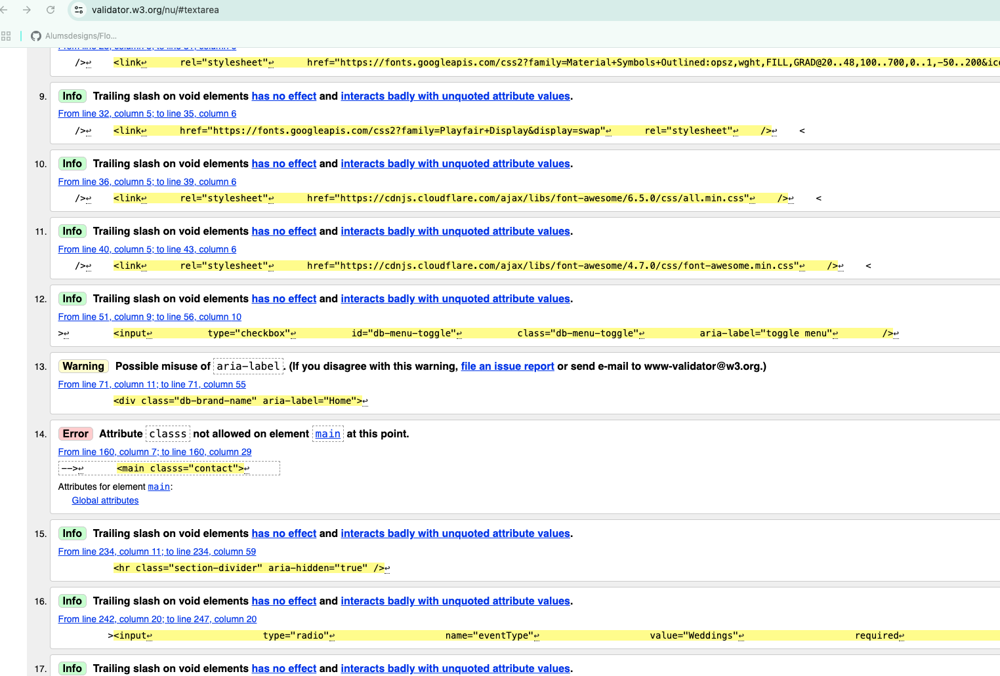
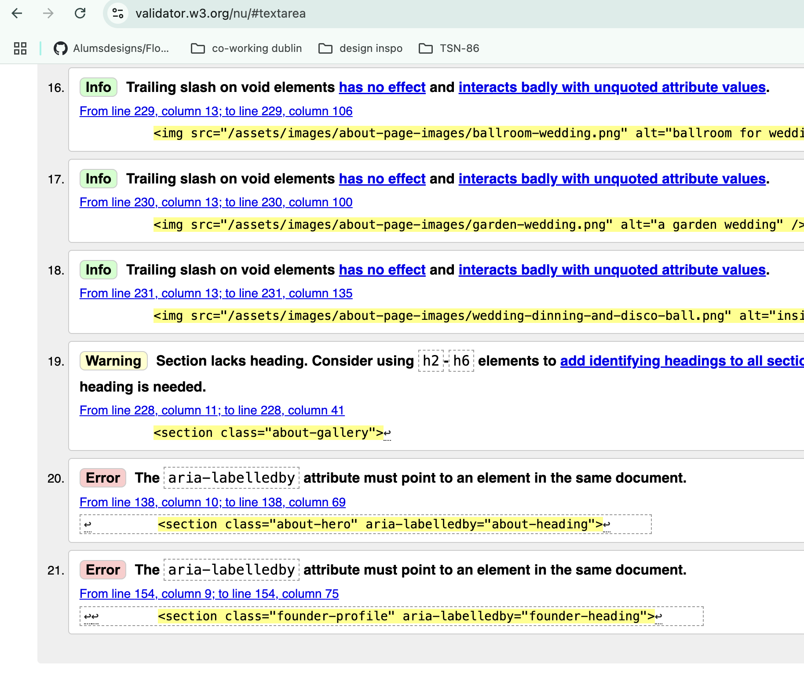
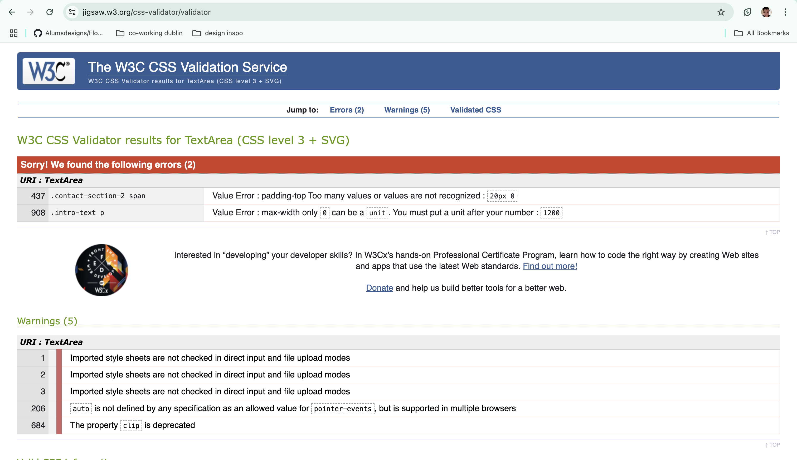
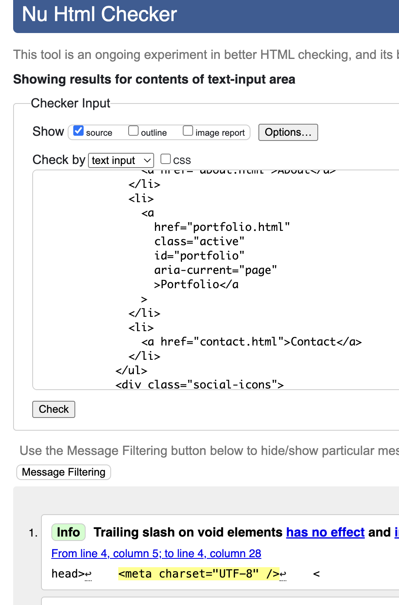
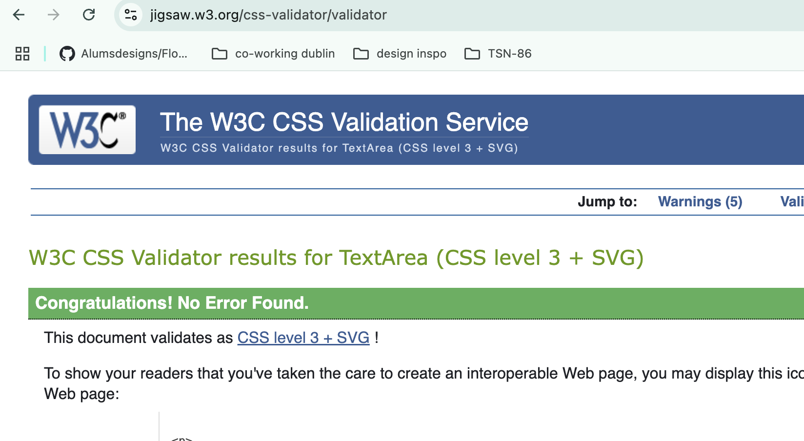

# DAVINALEILANIBLOOMS 

DAVINALEILANIBLOOMS is a luxury faux flower design studio providing elegant, sustainable floral decor for hire at events. The studio offers bespoke floral designs tailored for occasions such as weddings, corporate events, and private parties. The website serves as an informational and visual portfolio, showcasing past work and enabling prospective clients to engage and make inquiries.

The website is a responsive, mobile-friendly platform accessible on various screen sizes. 

Its primary audience includes individuals planning events who are interested in learning more about the studio’s services, viewing its portfolio, and making contact or inquiries.


[The website deployed can be found here](https://alumsdesigns.github.io/davinaleilaniblooms/)

# Contents
1. [User Experience (UX)](#1-user-experience-ux)
    - [User Stories](#user-stories)
        - [Customers](#customers)
        - [Business Owner](#business-owner)
2. [Features](#2-features)
    - [Current Features](#current-features)
3. [Design](#3-design)
4. [Technologies Used](#4-technologies-used)
5. [Testing](#5-testing)
6. [Deployment and Local Development](#6-deployment-and-local-development)
7. [Credits](#7-credits)

---

# 1. User Experience (UX)

## User Stories

### Customers
As a potential client planning an event:
- I want to easily browse a portfolio of past faux floral designs, so I can get inspiration and see the quality and style of DavinaLeilaniBlooms' work.
- To understand the different types of events DavinaLeilaniBlooms caters to (weddings, private parties, corporate), to see if their services are suitable for my needs.
- To quickly grasp what "luxury faux floral designs" means and why I should choose them over real flowers, as i want to see the unique value proposition.
- To be able to submit my event type and date through a form, to get a quick response.
- To find clear contact information (email, phone, address), to easily reach out with questions.
- To easily find links to DavinaLeilaniBlooms' social media channels, to follow their latest work, behind-the-scenes content, and testimonials.
- To find the address, to know their location or to plan a visit if necessary.
- To quickly access contact details like email and phone number in the footer, so I don't have to search the entire site for them.
- To know that the site is trustworthy


### Business Owner
As a Business owner:
- I want new website visitors to easily understand our unique value proposition (luxury faux florals) so that they are intrigued and stay on the site to learn more.
- To show case high-quality images and descriptions of our past projects in the portfolio, so potential clients can visualize our capabilities and be inspired to contact us.
- I want a clear and intuitive "Contact" section, to allow potential clients to easily submit their event details and express their interest, streamlining the initial inquiry process.
- I want to integrate social media links prominently, this will allow us to grow our online following and leverage social proof for marketing.
- To receive comprehensive details (event type, date, contact info) from the online contact form, to efficiently qualify leads and prepare for initial consultations.
- I want readily accessible email and phone contact information on the website, for clients to easily reach out for follow-up questions or support.
- I want the Privacy Policy to be easily findable, we comply with data protection regulations and build trust with clients.
- I want the website to reflect our luxury aesthetic and professional image, in order to reinforce our brand identity and appeal to our target high-end clientele.
- I want the "About Us" and "Process" information to be clear and transparent, need clients to feel confident and informed throughout their journey with us.


---

# 2. Features
## Current Features
Designed for intuitive user experience, the website features a clear navigation hamburger menu that allows seamless access to all four essential pages: Home, Portfolio, Contact Us, and About.

- All pages feature:
- Responsive Top and Footer Navigations with various means to get in contact and interact with the business:

### The responsive top naviagtion header across all pages features:
- Fully responsive navigation and interaction. On mobile, it displays in a single column, with a hamburger icon on the far left and the DavinaLeilaniBlooms logo (linking to the homepage) centrally located. 
 For tablet and desktop screens, the layout expands to a multi-column/grid view: the site logo and main menu links (Home, About, Portfolio, Contact Us) appear on the left, with the "Contact Us" link specifically aligned to the far right, and all navigation content centered.
 
 

 - When the Hamburger icon is clicked it transforms smoothly into an "X" and an overlay navigation with links to Home, About, Portfolio, and Contact pops out, the cursor also turns to a hand when hovering clickable links here. All internal navigation links work as expected and make it a breeze to browse the site. The overlay has interactive internal links and social links along with relevent contact infomrmation. Want to call just click the icon and sit back. See images:

  

- Social media icons and contact info accessible via navigation overlay. All clickable icons change color when hovered to white or beige and the cursor turns to a hand and leave an border to indicate active before opening external links to the there respective social platforms. See images:

 
 <!--  -->

### The responsive 'Footer' bottom naviagtion footer across all pages features:
- Everything the top navigation features with the DavinaLeilaniBlooms logo displaying bottom and central to assist with branding. - The email address, phone number and location are clickable (external) links.

- *The social links in the footer on mobile have been changed from column in the wireframes and some mockups to a row directing following user feedback after the first initial build.

- Every icon changes color on hover, the location icons opens google maps.

 
 

### The 'Home' page:
- A hero video of events plays automatically but allows the user controls to pause as they explore the website. Then images gracefully adapt to all screen sizes, ensuring the focal point is centered and the image fits well on any device.
- A brief introduction text provides users with a brief yet impactful overview, promoting luxury faux floral designs. Users gain a clear and comprehensive insight into DavinaLeilaniBlooms' brand and services. 
- A showcase of beautifully curated images of venues and event designs, presented in an elegant column structure for users to easily browse. These images are interactive when hovered.
- An image of the founder, accompanied by a brief personal introduction, fosters a deeper connection with users, allowing them to understand the vision and passion behind DavinaLeilaniBlooms. A call to action "Learn More" button invites further exploration.
- CTA's Call To Actions Button that change color on hover overlay two images stacked one after the other, finishing off the page inviting the viewer to delve deeper


###  The 'Contact' page:
- Website offers multiple avenues for prospective clients to connect, ensuring convenient and professional communication.
- contact details for DavinaLeilaniBlooms, includes a telephone number, email address, and studio location.
- The contact form contains intuitive radio event type selection catering to clients specify needs given the nature of their celebration – whether it's a wedding, corporate event, or private party – ensuring we understand their unique requirements from the outset.
- The form includes a mandatory input field for the event date, ensuring all submissions provide this crucial detail.
- Users can submit their inquiry by activating the 'Submit' button, conveniently located beneath the date of event  input field.
- A feedback modal pops up once the end user submits to reassure them there query has been submitted successfully. At present this is just for testing with plans to activate it with Javascript further down the line. Added features such as the calender using html5 where users can interact and pick a date along with instruction in red outlined below, guiding clients on what they need to do, ensuring an enjoyable experience.
- Seamlessly integrated responsive icons allow users to connect with DavinaLeilaniBlooms across all active social media platforms, including Instagram, Facebook, X, and YouTube.
- The email address, phone number and location are clickable (external) links.


###  The ‘Portfolio’ page:
- Images tell a thousand words. The images have a soft and elegant look that showcases a curated collection of exquisite luxury faux floral arrangements showcasing different events and aspects of events that we hosted in the past. 
- These compelling visuals offer a glimpse into the artistry, inspiring clients and demonstrating the beauty that was created for weddings, private celebrations, and bespoke events.


###  The ‘About’ page:
- Hero Section: Brand & Founder Introduction. Visual Hook with Hero Image and h1 with Core Message
- Founder Profile: Meet Davina Leilani, personal story and brand values.
- Team Member Spotlights Responsive section, with a picture, name, title and introductary informaton.
-  An about gallery section showcasing some more through the visual portfolio lens. Gives an sense of what you can dream and expect to receieve in real life also.


## Current Features

### General
- **Responsive Navigation Menu**: Available on all devices, with access to 'Home', 'About', 'Portfolio', and 'Contact Us'.
- **Header**: 
  - Hamburger menu with sliding sidebar (off - canvas menu) .
  - Concise introductory text (visible on larger screens only).
  - Persistent and intuitive site-wide menu.
- **Page-specific Responsive Background Imagery**: Tailored to match each page’s theme and adapt to screen sizes.
- **Footer**:
  - Includes contact and portfolio links, the studio’s logo, and social media icons.

### Home Page
- **Dynamic Hero Video**: A short, looping autoplay video showcasing past events.
- **Direct Service Inquiry Link**: Strategically placed to prompt user engagement.
- **Brand Essence Statement**: Highlights the core identity of DVelour Couture.
- **Visual Event Showcase**: Gallery with high-quality images of past floral event setups.
- **In-depth Brand & Service Overview**: Explains the studio's philosophy, values, and services.
- **Expertise Highlight**: Focuses on Devina, the lead designer’s experience and credentials.
- **Interactive Visual Navigation**: Image-based navigation with clickable elements.
- **Footer**: Consistent across pages with contact, social links, and branding.

### About Page
- **Striking Hero Image**: High-quality visual to establish visual ambiance.
- **Devina's Expertise Section**: Outlines qualifications and experience.
- **Prominent 'Contact Us' Link**: Accessible via the top navigation.
- **Interactive Visual Navigation**: Clickable image directing users to different event service inquiries.
- **Footer**: Contains consistent information and links.

### Portfolio Page
- **Visual Showcase**: 21 curated images of faux floral designs from past events.
- **Clickable Image Viewing**: Allows users to enlarge individual images.
- **Footer**: Provides essential contact and branding info.

### Contact Us Page
- **Hero Call to Action**: "SHARE YOUR VISION WITH US" to motivate engagement.
- **Contact Info**: 
  - Email for inquiries and project discussions.
  - Phone number for direct contact.
  - Physical address for correspondence or consultations.
- **Social Media Links**: Encouraging connections on Instagram, TikTok, Pinterest, and Twitter X.
- **"ENQUIRIES" Label**: Directs users to a dedicated section for submitting queries.
- **Contact Form**:
  - Captures event type and date for diary management.
  - Includes a follow-up page for detailed event information.

---

### Features which could be implemented in the future

- Proper Form Validation with error feedback
    - On a future iteration I hope to add proper form validation and error feedback for end users, possible with javascript.

---


# 3. Design
## Structure
The website comprises four pages, all of which feature the header at the top of the page and the footer at the bottom of the page.

## Wireframes
- ['Home' Page Wireframe](/assets/images/wireframes/home-page-wireframe.png)
- ['About' Page Wireframe](/assets/images/wireframes/About-page-wireframe.png)
- ['Portfolio' Page Wireframe](/assets/images/wireframes/Portfolio-page-wireframe.png)
- ['Contact' Page wireframe](/assets/images/wireframes/contact-wireframe.png)

In addition the contact page has a submission succesful pop up This is a placeholder for now.

## Colour Scheme


The color palette for DavinaLeilaniBlooms was thoughtfully selected to harmonize with the tones found in the brand’s curated imagery—florals, landscapes, and romantic moments. These hues not only frame each page with visual elegance but also serve a functional purpose,enhancing readability through high contrast and guiding the viewer’s attention with subtle sophistication. The overall result is a design that feels luxurious, timeless, and aligned with the refined aesthetic of our faux floral artistry.
The colour palette was created using [Coolors](https://coolors.co/).

## Typography

- [Google Fonts](https://fonts.google.com/) was used to add the following fonts:
- 'Playfair Display' is used for headings, this provides a visual contrast to the main body.
- 'Inter' is used for most body text and navigation, offering a beautiful, clean, and highly readable sans-serif font for accessibility and clarity.
- Fallbacks: If custom fonts cannot load, the site falls back to system fonts such as Arial, sans-serif, or serif for consistent rendering.

[Fontjoy](https://fontjoy.com/) proveded the best contrast options 

## Imagery
The images featured on the website were carefully selected to reflect the purpose of each page and to visually support the accompanying content. They are designed to highlight the luxury faux floral designs offered, while engaging users and encouraging them to explore the services further.

On the Portfolio page, close-up images with dark backgrounds were chosen to draw attention to the intricate details of the arrangements and maintain a cohesive, elegant aesthetic. A consistent 1 to 1 aspect ratio is used to ensure a clean, balanced layout that adapts seamlessly across all screen sizes.

## Icons
Icons were incorporated throughout the website as visual cues to enhance usability and user engagement. They serve as clear indicators for social media links and contact details, helping to guide visitors intuitively while adding a stylish and modern touch to the overall design.

All icons were sourced from [Font Awesome](https://fontawesome.com/)

All icons on your site are sourced from two places only:

Font Awesome — used for social media icons and other UI elements 
Google Material Icons — used for contact details and location 
Example:  
  ```html
  <i class="fa fa-facebook-square"></i>
```

Google Material Icons — used for contact details and location 
Example:  
  ```html
  <span class="material-icons-outlined">location_on</span>
```


---

# 4. Technologies Used
HTML and HTML5 - to create the structure of the website.

CSS AND ccs - to add style to the website.

[Chrome DevTools](https://developer.chrome.com/docs/devtools/) - used to help test features and for debugging.

[Google Fonts](https://fonts.google.com/) - a fonts library.

[Font Awesome](https://fontawesome.com/) - for iconography used on the website.

[Git](https://git-scm.com/) - for version control.

[GitHub](https://github.com/) - to create and store the project repository.

[GitPod](https://gitpod.io/) - development hosting platform used to create the website.

[Coolors](https://coolors.co/) - used to create the colour palette.

[Pixabay](https://pixabay.com/videos/wedding-dress-shoes-decoration-1309/) - used to source images.

[Unsplash](https://unsplash.com/) - used to source images.

[The W3C Markup Validation Service](https://validator.w3.org/) - Used to validate HTML files.

[The W3C CSS Validation Service](https://jigsaw.w3.org/css-validator/) - Used to validate the CSS file.

[Canva](https://www.canva.com/) - Used to Canva for design


---

# 5. Testing

This project underwent thorough testing to ensure functionality, responsiveness, and adherence to web standards across different environments.

Validators Used:
- W3C HTML Validator:  
[W3C HTML Validator Testing](#w3c-html-validator-testing) Used to check the structural integrity and validity of the HTML markup.
- W3C CSS Validator: 
[W3C CSS Validator Testing](#w3c-css-validator-testing) Employed to validate CSS syntax and ensure compliance with web standards.
- Development and Live Server Environments:
Live Server VS Code Extension: Utilized during development for real-time browser reloading and efficient local testing.
python3 -m http.server: A simple Python HTTP server used for local hosting and testing, especially when checking resource paths and form submissions.
- Browser Compatibility Testing
The website's rendering and functionality were tested across the following major browsers to ensure a consistent user experience:

Google Chrome (Developer Tools): Extensive testing and debugging were performed using Chrome's built-in developer tools.
Mozilla Firefox (Developer Tools): Cross-browser compatibility was verified, with Firefox's developer tools used for specific debugging.
Apple Safari (Developer Tools): Tested on macOS to ensure proper rendering and functionality on WebKit-based browsers.

This was the most effective way to test yet experienced issues with cache and reloading

### Reults from W3C CSS Validator as per image

No css errors see image [W3C CSS Validator Testing](#css-no-errors-w3s-validator.png)

Contact and home report trailing white space however my formatter keets adding them back in, I will continue to work on this.


### reults from W3C HTML Validator as per image
## ✅ HTML & CSS Validation

All errors reported by the [W3Schools HTML Validator](https://www.w3schools.com/html/html_validator.asp) have been **resolved**.

All remaining issues are **formatting-related warnings** caused by my VS Code formatter. These involve extra spacing/indentation that cannot be overridden at this time. They do **not affect the layout or functionality**, and CSS passes with **zero errors**.

### 📸 Some Validation Errors Screenshots Captures - errors fixed

| Page/File     | Validator Screenshot                                                                 |
|---------------|--------------------------------------------------------------------------------------|
| Home Page     |  |
| About Page    |        |
| Contact Page  |         |
| Portfolio Page|  |
| CSS File      |          |


### Manual User Testing Table
| ID  | Test Label              | Steps                                                                 | Expected Outcome                                                        |
|-----|-------------------------|-----------------------------------------------------------------------|-------------------------------------------------------------------------|
| T01 | Navigation - navbar     | Click each navbar link (Home, About, Portfolio...)                   | User is navigated to the correct page each time.                        |
| T02 | Navigation - Social     | Click each social media icon in the footer and...                    | Link opens correct social page in a new tab.                            |
| T03 | Navigation - Google map | On Contact page, click the address link.                             | Google Maps opens in a new tab with correct location.                  |
| T04 | Navigation - Hamburger  | On mobile/tablet, open and close the hamburger.?                    | Overlay nav opens/closes smoothly, all links are usable.               |
| T05 | UX - Hero Video         | On Home, check hero video loads and overlay text is readable.?     | Video is visible, plays, and text is legible over it.                  |
| T06  | UX - Scroll                  | Scroll up/down across all pages.                                         | Page scrolls smoothly without layout breakage.                                                 |
| T07  | UX - Animations              | Interact with animated elements (hover effects, transitions, etc).       | Animations are smooth and enhance usability.                                                   |
| T08  | Forms - Validation           | Submit contact form with missing/invalid fields.                         | Validation will be added and tested for future features, form submits to check modal works for now.                                         |
| T09  | Forms - Success Submission   | Fill and submit contact form with valid inputs.                          | Confirmation message appears, form clears or disables.                                         |
| T10  | Responsiveness - Desktop     | View site on desktop resolution.                                         | Layout adjusts appropriately, all content accessible.                                          |
| T11  | Responsiveness - Tablet      | View site on tablet resolution.                                          | Layout stacks or rearranges suitably, navigation works.                                        |
| T12  | Responsiveness - Mobile      | View site on mobile resolution.                                          | Layout fits screen, navigation is accessible and functional.                                   |
| T13  | Accessibility - Alt Text     | Inspect all images for alt text.                                         | All images have descriptive and appropriate alt attributes.                                    |

### Browser Compatibility

- Testing has been carried out on the following browsers :
    - Chrome Version 90.0.4430.212 (Official Build) (64-bit)
    - Firefox Version 88.0.1 (64-bit)
    - Edge Version 90.0.818.62 (Official build) (64-bit)
    - Safari on macOS Catalina (Safari  Version 14.0.3)

---

# 6. Deployment and Local Development
- Deplyment was deplayed on github due to global github maintanence the end of May 2025 and github pages still isn't back to optimal performance with site launches taking 12hurs+ as of June 2025see [Githubs announcements](https://www.githubstatus.com/) the end of Amy
- [View on githib pages](https://alumsdesigns.github.io/davinaleilaniblooms/) 

### How this site was deployed

- In the GitHub repository, navigate to the Settings tab, then choose Pages from the left hand menu 
- From the source section drop-down menu, select the Master Branch
- Once the master branch has been selected, the page will be automatically refreshed with a detailed ribbon display to indicate the successful deployment
- Any changes pushed to the master branch will take effect on the live project

  The live link can be found here - [DAVINALEILANI BLOOMS](https://alumsdesigns.github.io/davinaleilaniblooms/) 

### How to clone the repository

- Go to the - [DAVINALEILANI BLOOMS github repository](https://github.com/Alumsdesigns/davinaleilaniblooms) 
on gitgub
- Click the "Code" button to the right of the screen, click HTTPs and copy the link there
- Open a GitBash terminal and navigate to the directory where you want your cloned folder to live
- On the command line, type "git clone " then paste in the copied url and press the "Enter" key to begin the clone process

---

# 7. Credits

## Code
- Custom website code created by Damaris Alum.

## Content
- The content of the website was written by Damaris Alum.

## Media
- All icons on your site are sourced from two places only:

Font Awesome — used for social media icons and other UI elements 
Example:  
  ```html
  <i class="fa fa-facebook-square"></i>
  ```

Google Material Icons — used for contact details and location 
Example:  
  ```html
  <span class="material-icons-outlined">location_on</span>
```

Photographs were sourced from:
    - [Pexels](https://www.unspash.com/)
    - [gulnar mardanova](https://images.unsplash.com/photo-1734033923463-d32aa24ecca3)
    - [kasongo Bulobo](https://unsplash.com/photos/a-man-in-a-suit-and-tie-standing-in-front-of-a-building-4hJxAgMNiak)
    - [napat-saeng](https://unsplash.com/photos/woman-wearing-black-dress-KCTnilEFKjQ)
    - [Ikshana Production](xhttps://unsplash.com/s/photos/ikshana-productions-wedding)
    - [Redd francisco](https://unsplash.com/s/photos)
    - [kari Bjorn-](https://unsplash.com/s/photos)
    - [oxana-daeva](https://unsplash.com/s/photos)
    - [megan-bucknall](https://unsplash.com/s/photos)
    - [akhmad-jazuli](https://unsplash.com/s/photos)
    - [irena-carpaccio](https://unsplash.com/s/photos)
    - [pablo-lancaster-jone](https://unsplash.com/s/photos)
    - [arjun-lama](https://unsplash.com/s/photos)
    - [vitor-monthay](https://unsplash.com/s/photos)
    - [noelle-rebekah](https://unsplash.com/s/photos)
    - [fabio-guntur](https://unsplash.com/s/photos)
    - [kari-bjorn](https://unsplash.com/s/photos)
    - [jen-vazquez](https://unsplash.com/s/photos)
    - [freya-song](https://unsplash.com/s/photos)
    - [pew-nguyen](https://unsplash.com/s/photos)
    - [matt-seymour](https://unsplash.com/s/photos)
    - [tahiti-spears](https://unsplash.com/s/photos)
    - [alvin-mahmudov](https://unsplash.com/s/photos)
    - [britney-weng](https://unsplash.com/s/photos)
    - [oliver-augustijn](https://unsplash.com/s/photos)
    - [birmingham-museums-trust](https://unsplash.com/s/photos)
    - [etienne-girardet](https://unsplash.com/s/photos)
    - [jonathan-borba](https://unsplash.com/s/photos)
    - [samantha-gades](https://unsplash.com/s/photos)
    - [gulnar-mardanova](https://unsplash.com/s/photos)
    - [kasongo-bulobo](https://unsplash.com/s/photos)
    - [napat-saeng](https://unsplash.com/s/photos)
    - [iskra-photography](https://unsplash.com/s/photos)
    - [redd-francisco](https://unsplash.com/s/photos)
    - [sam-mathews](https://unsplash.com/s/photos)
    - [akhmad-jazuli](https://unsplash.com/s/photos)
    - [oxana-daeva](https://unsplash.com/s/photos)  
    - [Unsplash](https://pixabay.com/)
    - [Pixabay](https://pixabay.com/videos/wedding-dress-shoes-decoration-1309/)

*Note some images may have been renamed or deleted as the project evolves

## Acknowledgements
- Thanks to code institute and w3schools for their support